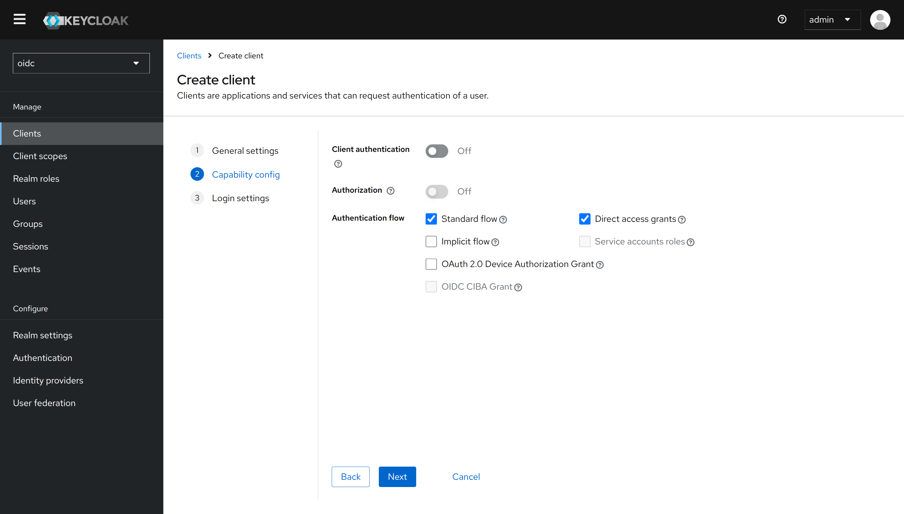
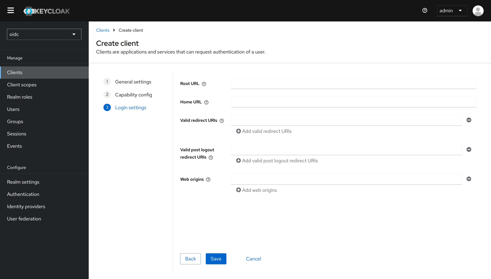

<h1 align="center">
    Passwordless Login with EUDI Wallets
</h1>

<p align="center">
    <a href="https://github.com/L3-iGrant/passwordless-login-playground/commits/" title="Last Commit"></a>
    <a href="https://github.com/L3-iGrant/passwordless-login-playground/issues" title="Open Issues"></a>
    <a href="./LICENSE" title="License"></a>
</p>

<p align="center">
  <a href="#about">About</a> •
  <a href="#technical-stack">Technical Stack</a> •
  <a href="#docker-support">Docker Support</a> •
  <a href="#implementation-guide">Implementation Guide</a> •
  <a href="#development-setup">Development Setup</a> •
  <a href="#environment-variables">Environment Variables</a> •
  <a href="#eslint-configuration">Environment Variables</a> •
  <a href="#contributing">Contributing</a> •
  <a href="#licensing">Licensing</a>
</p>

## About

This project serves as a playground for developers to understand how to integrate passwordless authentication in real-world frontend applications using EUDI Wallets with the OpenID Connect Extension.

By enabling the OpenID Connect extension in the iGrant.io Organisation Wallet and configuring Keycloak as a relying party (RP), organisations can allow users to log in without a password using their digital wallet credentials.

## Technical Stack

- React 19
- TypeScript
- Vite
- Keycloak integration
- Docker support
- OpenID Connect

## Docker Support

This project includes Docker support for easy deployment.

### Running with Docker

To build and run the application using Docker:

```bash
# Build and run with Docker Compose
docker compose up -d

# Or build and run manually
docker build -t passwordless-login .
docker run -p 5174:5174 passwordless-login
```

### Development with Docker

For development with hot-reloading, you can create a development Docker configuration. This isn't included by default but can be added as needed.

### Stopping the Docker Container

```bash
# If using Docker Compose
docker compose down

# Or manually stop the container
docker stop <container_id>
```

### Makefile Support

This project includes a Makefile for easier Docker operations:

```bash
# Build and run the application
make

# Only build the Docker image
make build

# Only run the container
make run

# Stop the container
make stop

# View container logs
make logs

# Clean up Docker resources
make clean

# Build and run without Docker Compose
make build-run

# Run npm commands inside the container
make npm-install
make npm-build  
make npm-lint
```

## Implementation Guide

### Configuring a Keycloak Client

1. In the Keycloak admin console navigate to **Clients** > **Create client**.

2. Set a **Client ID** (e.g. `React`) and proceed to the next step.
   


3. Leave these settings to their defaults (as seen in the image), proceed to the next step.  



4. Set the following values:
- **Valid redirect URIs**: `http://localhost:5174/login`:
- **Web origins**: `http://localhost:5174`:



## Development Setup

```bash
# Install dependencies
npm install

# Run development server
npm run dev

# Build for production
npm run build

# Preview production build
npm run preview
```

## Environment Variables

This application requires specific environment variables for Keycloak integration. Modify the `.env` file in the project root with the following variables:

```bash
# Keycloak Configuration
VITE_KEYCLOAK_URL=https://your-keycloak-server-url
VITE_KEYCLOAK_REALM=your-realm-name
VITE_KEYCLOAK_CLIENT_ID=your-client-id
VITE_KEYCLOAK_IDP_HINT=your-idp-alias
```

### Docker Environment Variables

When using Docker, you can either:

1. Configure environment variables in your `docker compose.yml`:
   ```yaml
   services:
     app:
       # ... other configuration
       environment:
         - VITE_KEYCLOAK_URL=https://your-keycloak-server-url
         - VITE_KEYCLOAK_REALM=your-realm-name
         - VITE_KEYCLOAK_CLIENT_ID=your-client-id
         - VITE_KEYCLOAK_IDP_HINT=your-idp-alias
   ```

2. Or create a `.env` file and use Docker Compose's env_file option:
   ```yaml
   services:
     app:
       # ... other configuration
       env_file:
         - .env
   ```

## ESLint Configuration

If you are developing a production application, we recommend updating the configuration to enable type-aware lint rules. See the [ESLint documentation](https://eslint.org/) for more details.

## Contributing

Feel free to improve the project and send us a pull request. If you find any problems, please create an issue in this repository.

## Licensing

Copyright (c) 2023-25 LCubed AB (iGrant.io), Sweden

Licensed under the Apache 2.0 License, Version 2.0 (the "License"); you may not use this file except in compliance with the License.

Unless required by applicable law or agreed to in writing, software distributed under the License is distributed on an "AS IS" BASIS, WITHOUT WARRANTIES OR CONDITIONS OF ANY KIND, either express or implied. See the LICENSE for the specific language governing permissions and limitations under the License.
